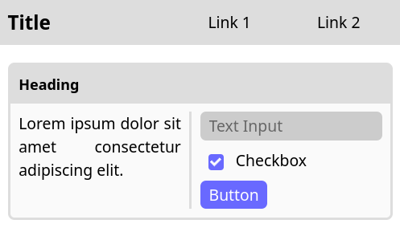
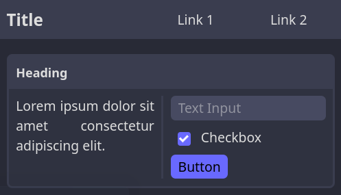

    
    <h1> Condensate </h1>

Condensate is a responsive css library with intuitive h-box/v-box layouting, scriptless components (including sidebar!), and simple but extensive themeing through css variables.

You can use condensate by putting the below into the `head` of your html:

`<link rel="stylesheet" href="https://cdn.jsdelivr.net/npm/@icosahunter/condensate@1.0.1-beta/dist/condensate.min.css">`

If you want to add the css file to your project directly see [releases](https://github.com/Icosahunter/condensate/releases)

## Beta Release! 🎉

Condensate is now [released in beta](https://github.com/Icosahunter/condensate/releases)! I believe it is feature complete and am happy with where it is. Please give it a try and if you come across any problems create an [issue](https://github.com/Icosahunter/condensate/issues)!

## Quick Look

    
    

## Documentation

A demo and documentation page can be found [here](https://icosahunter.github.io/condensate/).
